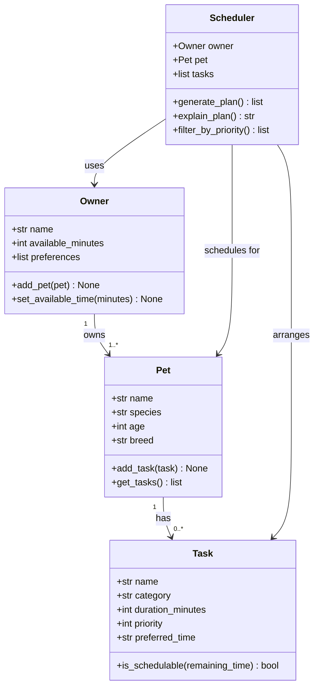

# PawPal+ Project Reflection

## 1. System Design

### Core User Actions

A PawPal+ user needs to be able to:

1. **Add a pet** — Enter basic information about their pet (name, species, age, breed) so the app can personalize care recommendations.
2. **Add or edit a care task** — Create tasks such as walks, feedings, medication reminders, or grooming sessions, each with a duration and a priority level so the system knows what matters most.
3. **Generate a daily schedule** — Ask the system to produce a prioritized daily plan that fits within the owner's available time, and see an explanation of why certain tasks were chosen or skipped.

### Building Blocks (Classes)

| Class | Attributes | Key Methods |
|---|---|---|
| `Owner` | name, available_minutes, preferences | `add_pet()`, `set_available_time()` |
| `Pet` | name, species, age, breed | `add_task()`, `get_tasks()` |
| `Task` | name, category, duration_minutes, priority, preferred_time | `is_schedulable()` |
| `Scheduler` | owner, pet, tasks | `generate_plan()`, `explain_plan()`, `filter_by_priority()` |

### UML Class Diagram (Mermaid)

**a. Initial design**

The design uses four classes. `Owner` holds the person's name and the time window they have each day (in minutes) along with any personal preferences. `Pet` belongs to an owner and collects the list of care tasks associated with that animal. `Task` is the central data object — it stores what the task is (category), how long it takes, and how urgent it is (priority 1–5). `Scheduler` is the "brain": it takes an owner and their pet's tasks, respects the available-time constraint, sorts by priority, and produces an ordered daily plan with a plain-language explanation.

**b. Design changes**

- Did your design change during implementation?
- If yes, describe at least one change and why you made it.

---

## 2. Scheduling Logic and Tradeoffs

**a. Constraints and priorities**

- What constraints does your scheduler consider (for example: time, priority, preferences)?
- How did you decide which constraints mattered most?

**b. Tradeoffs**

- Describe one tradeoff your scheduler makes.
- Why is that tradeoff reasonable for this scenario?

---

## 3. AI Collaboration

**a. How you used AI**

- How did you use AI tools during this project (for example: design brainstorming, debugging, refactoring)?
- What kinds of prompts or questions were most helpful?

**b. Judgment and verification**

- Describe one moment where you did not accept an AI suggestion as-is.
- How did you evaluate or verify what the AI suggested?

---

## 4. Testing and Verification

**a. What you tested**

- What behaviors did you test?
- Why were these tests important?

**b. Confidence**

- How confident are you that your scheduler works correctly?
- What edge cases would you test next if you had more time?

---

## 5. Reflection

**a. What went well**

- What part of this project are you most satisfied with?

**b. What you would improve**

- If you had another iteration, what would you improve or redesign?

**c. Key takeaway**

- What is one important thing you learned about designing systems or working with AI on this project?
