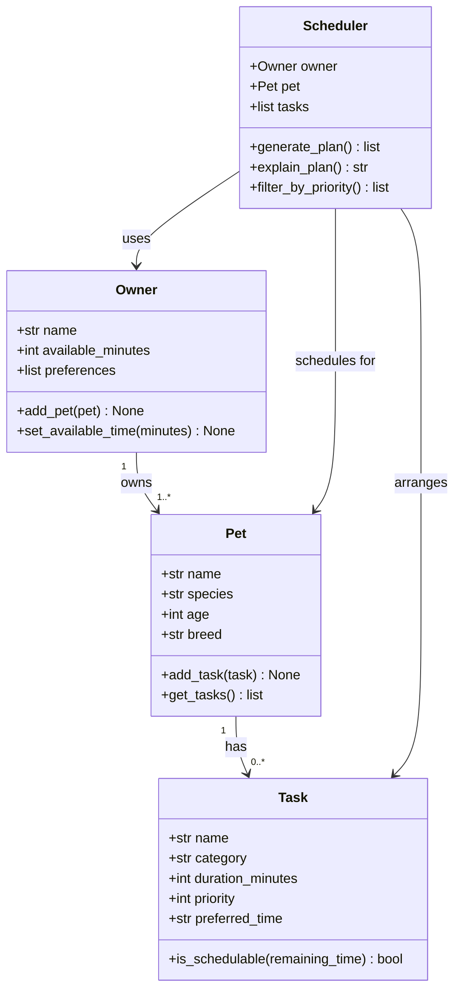

# PawPal+ Project Reflection

## 1. System Design

### Core User Actions

A PawPal+ user needs to be able to:

1. **Add a pet** — Enter basic information about their pet (name, species, age, breed) so the app can personalize care recommendations.
2. **Add or edit a care task** — Create tasks such as walks, feedings, medication reminders, or grooming sessions, each with a duration and a priority level so the system knows what matters most.
3. **Generate a daily schedule** — Ask the system to produce a prioritized daily plan that fits within the owner's available time, and see an explanation of why certain tasks were chosen or skipped.

### Building Blocks (Classes)

| Class | Attributes | Key Methods |
|---|---|---|
| `Owner` | name, available_minutes, preferences | `add_pet()`, `set_available_time()` |
| `Pet` | name, species, age, breed | `add_task()`, `get_tasks()` |
| `Task` | name, category, duration_minutes, priority, preferred_time | `is_schedulable()` |
| `Scheduler` | owner, pet, tasks | `generate_plan()`, `explain_plan()`, `filter_by_priority()` |

### UML Class Diagram (Mermaid)

**a. Initial design**

The design uses four classes. `Owner` holds the person's name and the time window they have each day (in minutes) along with any personal preferences. `Pet` belongs to an owner and collects the list of care tasks associated with that animal. `Task` is the central data object — it stores what the task is (category), how long it takes, and how urgent it is (priority 1–5). `Scheduler` is the "brain": it takes an owner and their pet's tasks, respects the available-time constraint, sorts by priority, and produces an ordered daily plan with a plain-language explanation.

**b. Design changes**

One significant change: the original skeleton gave `Scheduler` both an `owner` and a `pet` field, implying it would schedule for one pet at a time. During implementation it became clear that an owner with two pets needs a single unified schedule (otherwise the time budget is applied separately per pet and could be double-counted). `Scheduler` was simplified to hold only `owner`, and it aggregates all tasks from all pets via `owner.get_all_tasks()`. This is both cleaner and more realistic — a busy owner wants one consolidated daily plan, not two separate ones.

---

## 2. Scheduling Logic and Tradeoffs

**a. Constraints and priorities**

The scheduler considers two hard constraints: available time (tasks that don't fit are skipped entirely) and completion status (already-done tasks are never re-added). Within those constraints, it ranks by priority (1–5). Time of day (`preferred_time`, `start_time`) is used for display and conflict detection but does not gate task selection — a high-priority evening walk will still be scheduled even if the plan is generated in the morning. Priority was made the primary ranking signal because it directly encodes the owner's judgment about what matters most.

**b. Tradeoffs**

**Exact-match conflict detection vs. overlap detection.**
The `detect_conflicts()` method flags any two tasks that share the same `start_time` string (e.g., both set to `"07:30"`). It does *not* check whether a 30-minute task starting at `07:00` overlaps with a 20-minute task starting at `07:15`.

This is a deliberate simplification. True overlap detection requires computing each task's end time (`start + duration`) and checking interval intersections — O(n²) comparisons with more edge cases. For a daily pet-care planner used by a single owner with a handful of tasks, exact-match checking catches the most common mistake (scheduling two things at the same moment) while keeping the code easy to read and test. A future iteration could upgrade to interval-overlap detection if the app grows to support shared calendars or automated reminders.

---

## 3. AI Collaboration

**a. How you used AI**

- How did you use AI tools during this project (for example: design brainstorming, debugging, refactoring)?
- What kinds of prompts or questions were most helpful?

**b. Judgment and verification**

- Describe one moment where you did not accept an AI suggestion as-is.
- How did you evaluate or verify what the AI suggested?

---

## 4. Testing and Verification

**a. What you tested**

- What behaviors did you test?
- Why were these tests important?

**b. Confidence**

- How confident are you that your scheduler works correctly?
- What edge cases would you test next if you had more time?

---

## 5. Reflection

**a. What went well**

- What part of this project are you most satisfied with?

**b. What you would improve**

- If you had another iteration, what would you improve or redesign?

**c. Key takeaway**

- What is one important thing you learned about designing systems or working with AI on this project?
