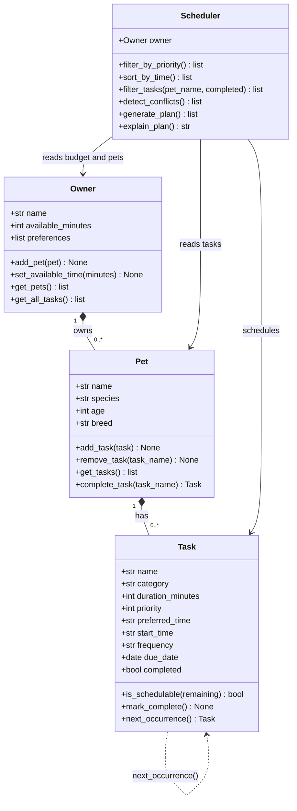

# PawPal+ Project Reflection

## 1. System Design

### Core User Actions

A PawPal+ user needs to be able to:

1. **Add a pet** — Enter basic information about their pet (name, species, age, breed) so the app can personalize care recommendations.
2. **Add or edit a care task** — Create tasks such as walks, feedings, medication reminders, or grooming sessions, each with a duration and a priority level so the system knows what matters most.
3. **Generate a daily schedule** — Ask the system to produce a prioritized daily plan that fits within the owner's available time, and see an explanation of why certain tasks were chosen or skipped.

### Building Blocks (Classes)

| Class | Key Attributes | Key Methods |
|---|---|---|
| `Owner` | name, available_minutes, preferences | `add_pet()`, `set_available_time()`, `get_all_tasks()` |
| `Pet` | name, species, age, breed | `add_task()`, `remove_task()`, `get_tasks()`, `complete_task()` |
| `Task` | name, category, duration_minutes, priority, preferred_time, start_time, frequency, due_date, completed | `is_schedulable()`, `mark_complete()`, `next_occurrence()` |
| `Scheduler` | owner | `generate_plan()`, `explain_plan()`, `filter_by_priority()`, `sort_by_time()`, `filter_tasks()`, `detect_conflicts()` |

### UML Class Diagram (Mermaid) — Final

**a. Initial design**

The design uses four classes. `Owner` holds the person's name and the amount of time they have each day in minutes along with any preferences. `Pet` belongs to an owner and keeps track of the list of care tasks for that animal. `Task` is the main data object because it stores the category of the task, how long it takes, and its priority from 1 to 5. `Scheduler` is the main controller. It takes an owner and all their tasks, applies the time limit, sorts by priority, and creates an ordered daily plan with a simple explanation.

**b. Design changes**

One important change came up during implementation. The original design had `Scheduler` storing both an `owner` and a `pet`, which meant it would create schedules for one pet at a time. This did not work well because an owner with multiple pets needs one combined schedule. Otherwise, the time limit would be applied separately for each pet and could be counted twice.

To fix this, `Scheduler` was simplified to only store the `owner`. It now collects all tasks from every pet using `owner.get_all_tasks()`. This makes the design cleaner and more realistic since a user would want one daily plan instead of multiple separate ones.

---

## 2. Scheduling Logic and Tradeoffs

**a. Constraints and priorities**

The scheduler focuses on two main constraints. The first is available time, so tasks that do not fit within the daily time limit are skipped. The second is completion status, meaning tasks that are already finished are not included again.

Within these limits, tasks are sorted by priority from 1 to 5. Time-related fields like `preferred_time` or `start_time` are mainly used for display and checking conflicts, not for deciding which tasks get scheduled. This means a high-priority task will still be included even if its preferred time does not match. Priority is the main factor because it reflects what the owner thinks is most important.

**b. Tradeoffs**

**Exact-match conflict detection vs. overlap detection.**

The `detect_conflicts()` method checks if two tasks have the exact same `start_time`. It does not check whether their time ranges overlap.

This was a deliberate simplification. Detecting overlaps would require calculating end times and comparing time intervals, which adds more complexity and edge cases. For a simple daily planner with only a few tasks, checking exact matches catches the most common mistake while keeping the code easy to understand and test. In the future, this could be improved to handle full overlap detection if needed.

---

## 3. AI Collaboration

**a. How you used AI**

AI was used throughout the project, but in different ways. In the beginning, it helped with design by generating a UML diagram based on the four classes. This saved time and helped identify missing relationships.

During implementation, it was used to generate method stubs and simple logic, such as sorting tasks by priority. Later, it helped suggest edge cases to consider, like how to handle tasks without a set time. It also suggested using a placeholder value so those tasks could be sorted to the end.

For testing, AI helped generate ideas for test cases and structure, but everything was still verified manually by running pytest.

The most helpful prompts were specific ones. When I gave clear inputs and expected outputs, the responses were much more useful. General prompts usually required more editing.

**b. Judgment and verification**

There were cases where AI suggestions had to be adjusted. For example, in the conflict detection feature, AI suggested raising an error when a conflict occurs. I decided not to use that approach because the application should warn the user instead of stopping completely.

I changed the implementation so it returns warning messages that can be shown in the interface. This allows the user to fix the issue without the program crashing.

To verify this, I wrote tests to make sure warnings were returned and that no errors were raised when conflicts exist.

---

## 4. Testing and Verification

**a. What you tested**

The final test suite includes 40 tests across several categories such as task behavior, pet management, owner data, scheduling logic, sorting, filtering, conflict detection, and recurring tasks.

These tests were important because the scheduler depends on multiple parts working together. If one part is incorrect, the final plan could be wrong without obvious errors. Testing each part individually helped ensure everything worked correctly before combining them.

Edge cases were especially important. I tested situations like having no tasks, zero available time, and all tasks already completed. These cases could lead to silent failures where the program runs but produces no useful output.

**b. Confidence**

Confidence level is 4 out of 5. The main functionality such as priority sorting, time limits, skipping completed tasks, recurring tasks, and conflict detection is well tested.

However, there are still some gaps. The Streamlit interface is not tested automatically, and conflict detection only checks exact matching times instead of full overlaps.

If I had more time, I would test cases like tasks crossing midnight, exact time boundary conditions, and user input validation in the interface.

---

## 5. Reflection

**a. What went well**

The strongest part of this project was keeping the logic separate from the user interface. All the main classes and scheduling logic were tested before connecting them to Streamlit. This made building the interface much easier because the core functionality was already working.

This separation also made it easy to add new features like sorting, filtering, and conflict detection without changing the UI. Starting with a clear design plan helped keep everything organized.

**b. What you would improve**

The current scheduling method is a simple greedy approach that selects tasks by priority until the time runs out. This can be inefficient because a long task might prevent several smaller tasks from being scheduled even if they would fit.

In the future, I would improve this by using a more advanced approach similar to the knapsack problem to better use the available time.

I would also add a method to reset completed tasks at the start of each day since that feature is currently missing.

**c. Key takeaway**

The most important takeaway is that AI is a useful tool but should not make decisions on its own. It can generate code quickly, but it does not understand the goals or requirements of the project.

When I relied too much on AI for decisions, the results did not match what I needed. The best approach was to define clear goals, use AI to assist with implementation, and verify everything with tests.

AI helps with how to build something, but the developer is responsible for deciding what should be built.

The most important thing I learned is that AI is a powerful *accelerator* but not a *decision-maker*. It can produce code quickly, but it does not know which design choices fit your specific goals, constraints, or users. The moment I let AI make architectural decisions without questioning them — like the early suggestion to raise exceptions on conflicts — the code stopped matching the actual user experience I was building. The human role is to define what the system should *do*, hold the AI to that spec, and verify its output against tests. AI handles the "how to write it"; the engineer handles the "what it should mean."
