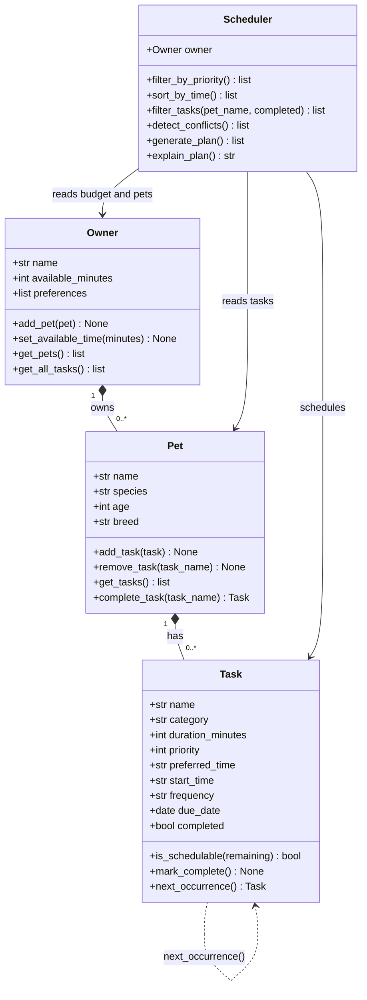

# PawPal+ Project Reflection

## 1. System Design

### Core User Actions

A PawPal+ user needs to be able to:

1. **Add a pet** — Enter basic information about their pet (name, species, age, breed) so the app can personalize care recommendations.
2. **Add or edit a care task** — Create tasks such as walks, feedings, medication reminders, or grooming sessions, each with a duration and a priority level so the system knows what matters most.
3. **Generate a daily schedule** — Ask the system to produce a prioritized daily plan that fits within the owner's available time, and see an explanation of why certain tasks were chosen or skipped.

### Building Blocks (Classes)

| Class | Key Attributes | Key Methods |
|---|---|---|
| `Owner` | name, available_minutes, preferences | `add_pet()`, `set_available_time()`, `get_all_tasks()` |
| `Pet` | name, species, age, breed | `add_task()`, `remove_task()`, `get_tasks()`, `complete_task()` |
| `Task` | name, category, duration_minutes, priority, preferred_time, start_time, frequency, due_date, completed | `is_schedulable()`, `mark_complete()`, `next_occurrence()` |
| `Scheduler` | owner | `generate_plan()`, `explain_plan()`, `filter_by_priority()`, `sort_by_time()`, `filter_tasks()`, `detect_conflicts()` |

### UML Class Diagram (Mermaid) — Final

**a. Initial design**

The design uses four classes. `Owner` holds the person's name and the time window they have each day (in minutes) along with any personal preferences. `Pet` belongs to an owner and collects the list of care tasks associated with that animal. `Task` is the central data object — it stores what the task is (category), how long it takes, and how urgent it is (priority 1–5). `Scheduler` is the "brain": it takes an owner and their pet's tasks, respects the available-time constraint, sorts by priority, and produces an ordered daily plan with a plain-language explanation.

**b. Design changes**

One significant change: the original skeleton gave `Scheduler` both an `owner` and a `pet` field, implying it would schedule for one pet at a time. During implementation it became clear that an owner with two pets needs a single unified schedule (otherwise the time budget is applied separately per pet and could be double-counted). `Scheduler` was simplified to hold only `owner`, and it aggregates all tasks from all pets via `owner.get_all_tasks()`. This is both cleaner and more realistic — a busy owner wants one consolidated daily plan, not two separate ones.

---

## 2. Scheduling Logic and Tradeoffs

**a. Constraints and priorities**

The scheduler considers two hard constraints: available time (tasks that don't fit are skipped entirely) and completion status (already-done tasks are never re-added). Within those constraints, it ranks by priority (1–5). Time of day (`preferred_time`, `start_time`) is used for display and conflict detection but does not gate task selection — a high-priority evening walk will still be scheduled even if the plan is generated in the morning. Priority was made the primary ranking signal because it directly encodes the owner's judgment about what matters most.

**b. Tradeoffs**

**Exact-match conflict detection vs. overlap detection.**
The `detect_conflicts()` method flags any two tasks that share the same `start_time` string (e.g., both set to `"07:30"`). It does *not* check whether a 30-minute task starting at `07:00` overlaps with a 20-minute task starting at `07:15`.

This is a deliberate simplification. True overlap detection requires computing each task's end time (`start + duration`) and checking interval intersections — O(n²) comparisons with more edge cases. For a daily pet-care planner used by a single owner with a handful of tasks, exact-match checking catches the most common mistake (scheduling two things at the same moment) while keeping the code easy to read and test. A future iteration could upgrade to interval-overlap detection if the app grows to support shared calendars or automated reminders.

---

## 3. AI Collaboration

**a. How you used AI**

AI was used at every phase, but in different roles. In Phase 1 it was a design partner — I described the four classes and asked it to produce the Mermaid UML skeleton, which saved time on boilerplate and helped surface missing relationships (like the fact that `Scheduler` should own the `Owner`, not a single `Pet`). In Phase 2 it acted as a code generator for method stubs; I provided the contract ("return tasks sorted highest priority first") and it produced the one-liner lambda sort. In Phase 3 I used it to brainstorm which edge cases mattered for a scheduling system and it suggested the `"99:99"` sentinel trick for sorting timeless tasks to the end. In Phase 4 it helped draft test names and structure, which I then verified manually by running pytest.

The most effective prompts were *constrained* ones: "Given these exact inputs, what should this function return, and why?" vague prompts like "make this better" produced noisy suggestions that needed heavy editing. Specific prompts with example data produced code I could validate immediately.

**b. Judgment and verification**

When generating the conflict-detection method, AI initially suggested raising a `ValueError` when a conflict was found. I rejected this because the project specification says the app should *warn* the user, not crash. A pet owner who accidentally schedules two tasks at the same time should see a clear `st.warning()` message and be able to fix it — not receive a Python traceback. I changed the implementation to collect warning strings and return them as a list, then display them in the UI with `st.error()`. I verified the choice by writing two tests: one confirming warnings are returned and another confirming no exception is raised even when conflicts exist.

---

## 4. Testing and Verification

**a. What you tested**

The final suite has 40 tests across eight categories: Task basics (mark_complete, is_schedulable), Pet management (add/remove/get, copy-safety), Owner aggregation, Scheduler plan generation, sorting, filtering, conflict detection, and recurring-task logic. These tests mattered because the scheduler's correctness depends on several interacting behaviors — if `filter_by_priority()` is wrong, `generate_plan()` silently produces a bad plan. Tests at the unit level let each piece be verified independently before the whole system is assembled. The edge cases (empty owner, zero budget, all-completed tasks) were especially important because those are the silent failures: the app would appear to work but produce nothing, and without a test you might not notice.

**b. Confidence**

Confidence level: **4 out of 5**. The core scheduling contract — priority ordering, time budget, completed-task skipping, recurring spawning, and conflict detection — is thoroughly covered. Two gaps remain: (1) the Streamlit UI is not integration-tested (clicking buttons is not automated), and (2) conflict detection checks only exact `start_time` equality, not true time-interval overlap. If I had more time, I would test: scheduling across the midnight boundary (a task due_date yesterday that recurs), a budget exactly equal to one task's duration (boundary check), and the UI form validation paths (invalid HH:MM format entered by a user).

---

## 5. Reflection

**a. What went well**

The part I'm most satisfied with is the separation between the logic layer (`pawpal_system.py`) and the UI (`app.py`). Because the Scheduler, Pet, and Task classes were designed and fully tested independently, connecting them to Streamlit in Phase 3 was mostly mechanical wiring — the logic was already correct and the tests proved it. That clean separation also made it easy to add new algorithmic features (sort, filter, recurrence, conflicts) without touching the UI at all, then surface them in the UI afterwards. Starting from a UML blueprint — even a rough one — made the implementation far more focused than starting from code directly.

**b. What you would improve**

The `Scheduler.generate_plan()` method is a simple greedy algorithm: it takes high-priority tasks first until the budget runs out. This can leave a lot of time on the table if a high-priority long task is followed by many small tasks that would all fit. A next iteration would explore a knapsack-style approach — try to maximize the number of high-priority tasks packed into the budget rather than stopping as soon as one doesn't fit. I'd also add a `reset_daily()` method to `Pet` that clears all `completed` flags at the start of a new day, which the current system lacks entirely.

**c. Key takeaway**

The most important thing I learned is that AI is a powerful *accelerator* but not a *decision-maker*. It can produce code quickly, but it does not know which design choices fit your specific goals, constraints, or users. The moment I let AI make architectural decisions without questioning them — like the early suggestion to raise exceptions on conflicts — the code stopped matching the actual user experience I was building. The human role is to define what the system should *do*, hold the AI to that spec, and verify its output against tests. AI handles the "how to write it"; the engineer handles the "what it should mean."
